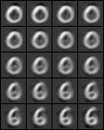

An extension of the neural network tutorial code, where I just try to visualize the interpolation between examples in a Sparse Autoencoder at both input as well as middle layer.

The idea was to inspect the hypothesis presented in the following paper: 
[Better mixing via deep representations](http://arxiv.org/abs/1207.4404)

Thanks to the rewrite of the [ufldl tutorial](http://ufldl.stanford.edu/wiki/index.php/UFLDL_Tutorial) done by [jperla](https://github.com/jperla/neural).

For the interpolation part, just run mnist_interpolate.py (after adding mnist.pkl.gz in ../data/).
I have precomputed the Weights and Biases and store them in W1.py, W2.py, b1.py and b2.py. They can be directly loaded or trained using train_sparse_autoencoder_on_mnist.py code.

